[简体中文](README.md) | **English**

<picture>
  <source media="(max-width: 640px) and (prefers-color-scheme: dark)" srcset="assets/presentation/hero-mobile-dark.svg">
  <source media="(max-width: 640px)" srcset="assets/presentation/hero-mobile-light.svg">
  <source media="(prefers-color-scheme: dark)" srcset="assets/presentation/hero-dark.svg">
  
</picture>

**HarnessProbe stores prompts and decoding settings in typed profiles, runs a shared arithmetic subset through compatible endpoints, and produces comparison matrices, HTML and run artifacts.**

`Python 3.12+` · [MIT](LICENSE) · [GitHub](https://github.com/SuperMarioYL/harnessprobe) · [Website](https://harnessprobe.lei6393.com)

## Why it helps

Comparing evaluations requires more than a model name: system prompts, stops, temperature and output limits matter. Explicit settings make differences easier to inspect. The tool reads declared profiles; it does not discover unpublished vendor harnesses or guarantee that bundled reference scores match current official results.

<picture>
  <source media="(max-width: 640px) and (prefers-color-scheme: dark)" srcset="assets/presentation/process-mobile-dark.svg">
  <source media="(max-width: 640px)" srcset="assets/presentation/process-mobile-light.svg">
  <source media="(prefers-color-scheme: dark)" srcset="assets/presentation/process-dark.svg">
  
</picture>

## Architecture

profile.py parses a controlled YAML subset and validates it with Pydantic. runner formats problems, calls OpenAICompatAdapter and stores scored per-problem results. matrix aggregates scores and differences from declared reference scores; report writes HTML and ZIP. Without a key or endpoint, the adapter uses a deterministic stub that must be distinguished from real inference.

<picture>
  <source media="(max-width: 640px) and (prefers-color-scheme: dark)" srcset="assets/presentation/architecture-mobile-dark.svg">
  <source media="(max-width: 640px)" srcset="assets/presentation/architecture-mobile-light.svg">
  <source media="(prefers-color-scheme: dark)" srcset="assets/presentation/architecture-dark.svg">
  
</picture>

## Install

Requires Python 3.12+. Installation may need network access; begin with the configuration example, which sends no requests and generates no stub answers.

```bash
git clone https://github.com/SuperMarioYL/harnessprobe.git
cd harnessprobe
python3 -m venv .venv
source .venv/bin/activate
python -m pip install -e .
```

## Quickstart

```bash
python examples/presentation_demo.py
```

The supplied YAML declares local-demo, a 64-token limit, END stop and no reference score. Real load_profile parsing succeeds, an adapter without a key is identified as stub, and invalid reasoning_effort is rejected. The script calls neither complete nor run_match, so it produces no model scores.

## Usage

```bash
# Inspect bundled profile metadata
harnessprobe profiles

# After configuring a service and credentials, require actual requests
harnessprobe match --models path/to/profile.yaml --bench aime --n 10 --require-live --html report.html --repro run.zip

# Render a report from saved summary state
harnessprobe report --state .harnessprobe-last.json --out report.html
```

A custom YAML path can be used as a --models profile key. Only the aime benchmark path is implemented; this is not a guarantee of the complete official AIME protocol. --require-live rejects missing credentials, but inspect individual requests for failures.

## Capabilities and integrations

| Component | Current behavior |
|---|---|
| YAML profile | Loading, field validation and metadata |
| Compatible HTTP endpoint | System prompt, decoding settings and problem requests |
| Arithmetic subset | Prompt formatting, integer-answer extraction and scoring |
| GapMatrix | Scores and differences from profile reference values |
| HTML / ZIP | Summaries and per-problem material from the run |

<picture>
  <source media="(max-width: 640px) and (prefers-color-scheme: dark)" srcset="assets/presentation/integrations-mobile-dark.svg">
  <source media="(max-width: 640px)" srcset="assets/presentation/integrations-mobile-light.svg">
  <source media="(prefers-color-scheme: dark)" srcset="assets/presentation/integrations-dark.svg">
  
</picture>

## Configuration and limits

Requests apply model_name, system_prompt, temperature, max_tokens, stop_tokens, decoding and reasoning_effort. tool_call_template and provenance are stored metadata; the current adapter does not construct tools/function schemas from them.

api_key_env names the environment variable and CLI --base-url can override the endpoint. Missing keys or endpoints trigger deterministic test answers based on expected answers; those scores are unsuitable for procurement, model rankings or quality claims. published_score is an input reference and a gap does not establish a harness-caused difference.

--save stores summaries without all original responses. repro --state reruns evaluations and may contact services again rather than recovering old responses. Use --repro during match to preserve that run’s material.

## Recorded demo

A real offline configuration preflight on v0.1.0, not a benchmark. qwen is an allowed schema label and example-model is a constructed identifier; no service availability is established.

[Inputs, commands and complete output](docs/demo-results.json)

[Retained terminal recording](assets/demo.gif) · [Recording script](docs/demo.tape). The replayable record above describes this example.

## Roadmap

- [x] Typed profiles, compatible-endpoint runner and comparison matrix.
- [x] HTML, run-result ZIP and summary state.
- [ ] Interactive profile editing and more benchmark tasks.
- [ ] Broader endpoint and protocol validation.

No deployed enterprise subscription or certified reconstruction of private vendor harnesses is provided.

## Development and license

```bash
python -m pip install -e ".[dev]"
python -m pytest
```

See harnessprobe/adapters/openai_compat.py for the actual request fields.

[MIT](LICENSE) · [Issues](https://github.com/SuperMarioYL/harnessprobe/issues)
