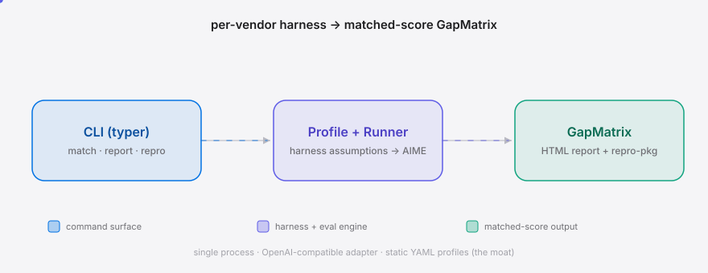
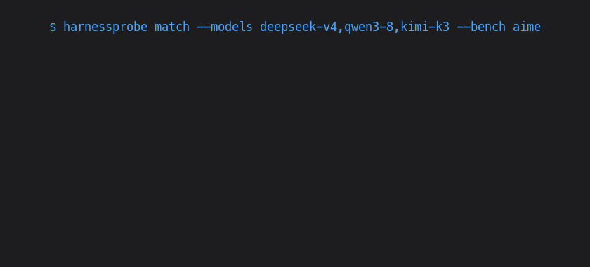

[English](./README.en.md) | **简体中文**

<picture>
  <source media="(prefers-color-scheme: dark)" srcset="./assets/hero-dark.svg">
  <source media="(prefers-color-scheme: light)" srcset="./assets/hero-light.svg">
  
</picture>

<p align="center"><sub>逆向国产大模型评测 harness 假设，生成信创采购级匹配分数对比矩阵</sub></p>

<p align="center">
  <a href="./LICENSE"></a>
  <a href="https://github.com/SuperMarioYL/harnessprobe/releases"></a>
  <a href="https://github.com/SuperMarioYL/harnessprobe/actions/workflows/test.yml"></a>
  
  
  
</p>

<p align="center"><b>DeepSeek V4 / Qwen3.8 / Kimi K3 的厂商公布分数都绑定未公开的评测 harness 假设——HarnessProbe 逆向它们，在同一组基准上跑出可对比的匹配分数与差距。</b></p>

<picture>
  <source media="(prefers-color-scheme: dark)" srcset="./assets/atlas-dark.svg">
  <source media="(prefers-color-scheme: light)" srcset="./assets/atlas-light.svg">
  
</picture>

<h2> 为什么存在</h2>

国产大模型厂商（DeepSeek、Qwen、Kimi）现在发布的基准分数都绑定专有、未公开的 "harness minimal mode" 配置——DeepSeek V4 Flash 0731 的 Terminal-Bench 82.7% 使用了至今未发布的 "DeepSeek Harness minimal mode"。当三家国产前沿模型同时存在、且各自分数跑在不同 harness 假设下时，**未匹配 harness 的三方对比毫无意义**。信创采购团队在签约私有化部署前，需要的是 apples-to-apples 的可复现证据，而不是厂商营销数字。HarnessProbe 把每家厂商的 system prompt、tool-call 模板、stop tokens、reasoning-effort 与温度逆向成类型化的 `HarnessProfile`，施加到各自模型、同一组 AIME 子集上，输出厂商公布分 vs 匹配复现分 vs 差距。

<h2> 安装与快速开始</h2>

```bash
uv tool install harnessprobe          # 或 pip install harnessprobe
export DEEPSEEK_API_KEY=... DASHSCOPE_API_KEY=... MOONSHOT_API_KEY=...
harnessprobe match --models deepseek-v4,qwen3-8,kimi-k3 --bench aime
```

> 没有设置 API key 时，HarnessProbe 自动进入 **stub 模式**——产出确定性、vendor 差异化的占位分数，让整个 pipeline 端到端可跑（供 CI / 演示 / 测试），但分数不代表厂商真实表现。设置三家的 key 即可切换到 live 模式。

<details><summary>样例输出</summary>

```
                        GapMatrix — AIME (30 problems)
┏━━━━━━━━━━┳━━━━━━━━━━━━━━━━━━━┳━━━━━━━━━━━┳━━━━━━━━━┳━━━━━━━━┳━━━━━━━━━┳━━━━━━┓
┃ Vendor   ┃ Model             ┃ Published ┃ Matched ┃    Gap ┃ Correct ┃ Mode ┃
┡━━━━━━━━━━╇━━━━━━━━━━━━━━━━━━━╇━━━━━━━━━━━╇━━━━━━━━━╇━━━━━━━━╇━━━━━━━━━╇━━━━━━┩
│ deepseek │ deepseek-v4-pro-… │     79.80 │   70.00 │  -9.80 │   21/30 │ stub │
│ kimi     │ kimi-k3-0813      │     75.50 │   53.33 │ -22.17 │   16/30 │ stub │
│ qwen     │ qwen3.8-0813      │     77.20 │   46.67 │ -30.53 │   14/30 │ stub │
└──────────┴───────────────────┴───────────┴─────────┴────────┴─────────┴──────┘

Largest harness inflation: qwen/qwen3.8-0813 — published 77.20, matched 46.67, gap -30.53 pts.
```

</details>

<h2> 用法</h2>

五个核心子命令覆盖从匹配复现到导出 RFP 证据的完整链路：

```bash
# 列出内置 profile（护城河：逆向得到的 per-vendor 假设集）
harnessprobe profiles

# 核心命令：三家模型跑同一 AIME 子集，打印 GapMatrix
harnessprobe match --models deepseek-v4,qwen3-8,kimi-k3 --bench aime --n 30

# 一步到位：匹配 + HTML 报告 + repro-pkg
harnessprobe match --models deepseek-v4,qwen3-8,kimi-k3 --n 30 \
  --html report.html --repro repro.zip

# 从已保存的匹配状态渲染 HTML 报告
harnessprobe report --state .harnessprobe-last.json --out report.html

# 导出逐字可复现的 repro-pkg（profile + prompt + 原始输出），交给甲方答辩
harnessprobe repro --state .harnessprobe-last.json --out repro.zip

# 编程 API：见 examples/basic_usage.py
```

`match` 是主命令：跑完写入 `.harnessprobe-last.json` 状态文件，后续 `report` / `repro` 可从该状态读取，无需重跑。`--base-url` 可指向私有化 vLLM / SGLang 端点。完整 CLI 参考 `harnessprobe match --help`。

<h2> Demo</h2>



10 分钟 happy path：`pip install` → `match` → `report` → `repro`，详见 [`docs/demo.tape`](docs/demo.tape)（vhs 脚本，CI 按需重渲染）。

<h2> 配置</h2>

HarnessProfile 是静态 YAML，平铺在 `harnessprobe/profiles/`。核心字段：

| 字段 | 类型 | 默认 | 含义 |
|---|---|---|---|
| `vendor` | str | — | `deepseek` / `qwen` / `kimi` |
| `model_name` | str | — | 发往 OpenAI 兼容端点的 model 串 |
| `system_prompt` | str | — | 逆向得到的 minimal-mode system prompt |
| `reasoning_effort` | str\|null | null | `low`/`medium`/`high`——推理模型 harness 杠杆点 |
| `temperature` | float | 0.0 | 评测 harness 通常用贪心解码 |
| `stop_tokens` | list[str] | `[]` | stop-token 策略（逆向指纹） |
| `decoding` | dict | `{}` | top_p / presence_penalty 等 |
| `provenance` | list[str] | `[]` | 公开线索来源（reddit / card / 反推）——采购审计依据 |
| `published_score` | dict | `{}` | 厂商公布分（基准名 → 分数） |
| `api_key_env` | str | — | 规范命名：`DEEPSEEK_API_KEY` / `DASHSCOPE_API_KEY` / `MOONSHOT_API_KEY` |
| `base_url` | str | — | OpenAI 兼容端点 |

环境变量（schema-smoke 验证）：

| 变量 | 厂商 | 默认端点 |
|---|---|---|
| `DEEPSEEK_API_KEY` | DeepSeek | `https://api.deepseek.com/v1` |
| `DASHSCOPE_API_KEY` | Qwen | `https://dashscope.aliyuncs.com/compatible-mode/v1` |
| `MOONSHOT_API_KEY` | Kimi | `https://api.moonshot.cn/v1` |

> 两家厂商内部 harness 字段（精确 function-call schema 形状、内部 stop-token 优先级）UNVERIFIED——profile 标注为 best-effort 逆向，靠 `harnessprobe profile edit`（m3）持续调优。

<h2> 路线图</h2>

- [x] **m1 — profile 编码**：`HarnessProfile` Pydantic schema 落定；DeepSeek V4 种子 profile；单端点跑 AIME 子集产出匹配分 + 差距
- [x] **m2 — 匹配矩阵**：补齐 Qwen3.8 / Kimi K3 profile；3 家 × GapMatrix；HTML 报告 + repro-pkg 导出 **（v0.1 发布版，当前版本）**
- [ ] **m3 — profile 编辑器**：交互式 `harnessprobe profile edit`（探针端点、diff 假设）；私有化端点探针；信创集成商定制 profile 服务
- [ ] **未来**：全量 Terminal-Bench 2.1 智能体复现（v0.2 钩子，需终端沙箱 + agent 循环）；季度 per-vendor Profile Pack 订阅

<h2> 付费 / Pricing</h2>

HarnessProbe 的商业化路径与专有数据护城河对齐——**免费 OSS runner 是进入 30+ 信创组织的特洛伊木马；积累的 per-vendor 逆向 profile 集才是付费项**。

| 层级 | 内容 | 定价 |
|---|---|---|
| **OSS 免费** | runner + 3 个种子 profile + AIME 矩阵 + HTML 报告 + repro-pkg | ¥0（MIT） |
| **Profile Pack 订阅** | 季度更新的全量 per-vendor 逆向假设集（DeepSeek/Qwen/Kimi）+ provenance + 历史快照 | ¥30k–80k / 年 / 集成商站点授权 |
| **定制 profile probing** | 私有化端点探针 + 一次定制 profile 逆向服务（m3 范围） | ¥15–30k / 次 |
| **企业 license** | 审计版 per-vendor 矩阵，集成商在 RFP 答辩中引用 | ¥50k–200k / 年 / 集成商 |

首批付费客户：**信创集成商**（中国软件 / 太极 / 神州数码）——他们对 RFP 中的基准声明负有合同责任，需要可辩护的匹配分数 + 能交给甲方逐字复跑的 `repro-pkg`，而他们无法自行逆向 per-vendor profile（专有数据护城河）。结算：微信支付 / 对公转账 + license-key（v0.1 不做云托管 SaaS）。详见 [GTM 文档](#) 与 `BUILD_SETUP_NEXT_STEPS.md`。

<h2> License</h2>

[MIT](./LICENSE)。欢迎在 [GitHub Issues](https://github.com/SuperMarioYL/harnessprobe/issues) 提问题或 PR。

<p align="center"><sub><a href="./LICENSE">MIT</a> © 2026 SuperMarioYL</sub></p>
